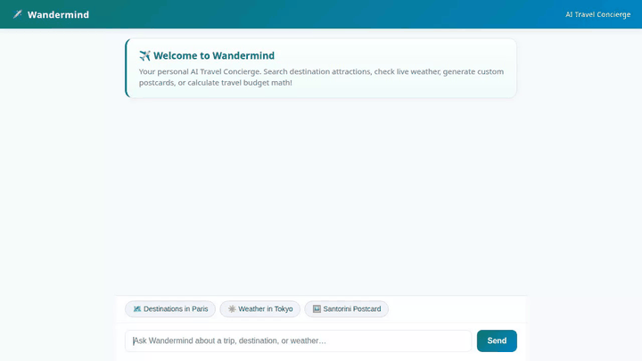

# ✈️ Wandermind — Personal AI Travel Concierge

Wandermind is a production-grade AI travel assistant built using the **Google Agent Development Kit (ADK)** and deployed to **Vertex AI Agent Runtime**. It features cross-session long-term memory, Firestore destination search, live weather, Google Maps geocoding and places, Gemini-powered scenic postcard generation, Google Omni AI video creation, and rich interactive A2UI card rendering.



---

## 🌟 Implemented Features & Architecture

Wandermind's backend and tool ecosystem are built directly on Google Cloud infrastructure and open APIs:

### 🧠 1. Cross-Session Long-Term Memory (Vertex AI Memory Bank)
* **Service**: `VertexAiMemoryBankService` (Vertex AI Agent Engine)
* **Integration**: `PreloadMemoryTool()` and `generate_memories_callback`
* **Capability**: Automatically saves and recalls user travel preferences (e.g., preferred travel pace, dietary restrictions, favorite activities, budget constraints) across different conversation sessions.

### 🏛️ 2. Destination Catalog (Google Cloud Firestore)
* **Database**: Firestore NoSQL Collection (`destinations`)
* **Tools**: `search_destinations`, `get_destination_details`, `add_destination`
* **Capability**: Allows filtering attractions by city (Kyoto, Paris, Tokyo, etc.), category (Nature, Culture, Culinary), rating, and price tier (`$`, `$$`, `$$$`).

### ☁️ 3. Media Storage & Hosting (Google Cloud Storage)
* **Bucket**: Public Cloud Storage Media Bucket
* **Tools**: `generate_destination_postcard`, `generate_destination_video`
* **Capability**: Uploads generated images and videos directly to Cloud Storage and returns public HTTPS URLs for seamless inline UI rendering.

### 🎨 4. AI Image Postcard Synthesis (Gemini 3.1 Flash Image)
* **Model**: `gemini-3.1-flash-lite-image`
* **Tool**: `generate_destination_postcard`
* **Capability**: Generates high-resolution scenic postcards for destinations, saves artifacts to ADK context, and uploads bytes to GCS.

### 🎥 5. AI Video Generation (Google Omni Model)
* **Model**: `gemini-omni-flash-preview` (Region: `global` via Vertex AI Interactions API)
* **Tool**: `generate_destination_video`
* **Capability**: Synthesizes short promotional video clips for travel destinations and stores them in GCS.

### 📍 6. Google Maps Platform Integration
* **APIs**: Google Geocoding API & Google Places API (New)
* **Tools**: `geocode_address`, `find_nearby_places`
* **Capability**: Resolves physical location coordinates and searches nearby dining, landmarks, and cultural spots.

### ☀️ 7. Live Weather & Currency Exchange APIs
* **Services**: wttr.in & Frankfurter Currency API
* **Tools**: `get_live_weather`, `get_exchange_rates`, `get_current_time`
* **Capability**: Fetches live weather conditions, temperature, humidity, and real-time foreign currency conversions.

### 💻 8. Code Sandbox Execution
* **Executor**: `AgentEngineSandboxCodeExecutor`
* **Capability**: Executes Python code for budget calculations and complex itinerary math.

### 🖼️ 9. Rich Display UI (A2UI Schema v0.8)
* **Callback**: `a2ui_callback`
* **Capability**: Converts structured agent responses into interactive A2UI cards, columns, text nodes, and image displays.

### 🌐 10. Web Chat Frontend (FastAPI + A2A Protocol)
* **Directory**: `./frontend`
* **Technology**: Vanilla HTML5, CSS3, JavaScript, and FastAPI talking the A2A protocol.

---

## 🔮 Roadmap / Status of Planned Features

| Feature | Status | Description |
| :--- | :---: | :--- |
| **Memory Bank Persistence** | ✅ Implemented | Vertex AI Memory Bank saving facts/preferences across sessions |
| **Firestore Destination Query** | ✅ Implemented | Real-time database catalog lookups and item insertion |
| **GCS Public Media Hosting** | ✅ Implemented | Direct upload of generated postcards and videos to Cloud Storage |
| **Gemini Postcard Generation** | ✅ Implemented | AI image synthesis via `gemini-3.1-flash-lite-image` |
| **Google Omni Video Tool** | ✅ Implemented | AI video generation via `gemini-omni-flash-preview` |
| **Google Maps Geocoding & Places** | ✅ Implemented | Real-time places search and coordinate geocoding |
| **Live Weather & Exchange Rates** | ✅ Implemented | Live weather and currency conversion API tools |
| **A2UI Card Renderer** | ✅ Implemented | Native card rendering in web chat interface |
| **Flight Booking GDS Integration** | ⏳ Planned | Direct GDS airline ticket reservation integration |
| **Payment Gateway Integration** | ⏳ Planned | Stripe / Google Pay itinerary checkout |

---

## 🚀 Setup & Local Execution

Follow these steps to run Wandermind locally.

### Prerequisites

1. **Python 3.11+** and [`uv`](https://docs.astral.sh/uv/)
2. **Google Cloud SDK** signed in with active GCP Project:
   ```bash
   gcloud auth login
   gcloud auth application-default login
   gcloud config set project <YOUR_GCP_PROJECT_ID>
   ```
3. **Google Maps API Key**:
   Set `GOOGLE_MAPS_API_KEY` in your environment or `.env` file.

### Installation

1. Install project dependencies:
   ```bash
   uv sync
   ```

2. (Optional) Run local ADK Agent Playground:
   ```bash
   uv run agents-cli playground
   ```

### Running the Web Chat Frontend

1. Navigate to the `frontend` folder:
   ```bash
   cd frontend
   ```

2. Set required environment variables and launch the FastAPI server:
   ```bash
   export AGENT_ENGINE_RESOURCE_NAME="projects/<PROJECT_NUMBER>/locations/us-east1/reasoningEngines/<ENGINE_ID>"
   export AGENT_DIRECTORY="app"
   export PORT="8080"
   
   uv run python3 main.py
   ```

3. Open your browser and navigate to the local server address displayed in the terminal output.

---

## 🛡️ License & Acknowledgments

Built for the **Google Build with Google Track 2 Workshop / Agentic AI Hackathon** using Google Agent Development Kit (ADK), Vertex AI Agent Runtime, and Gemini models.
